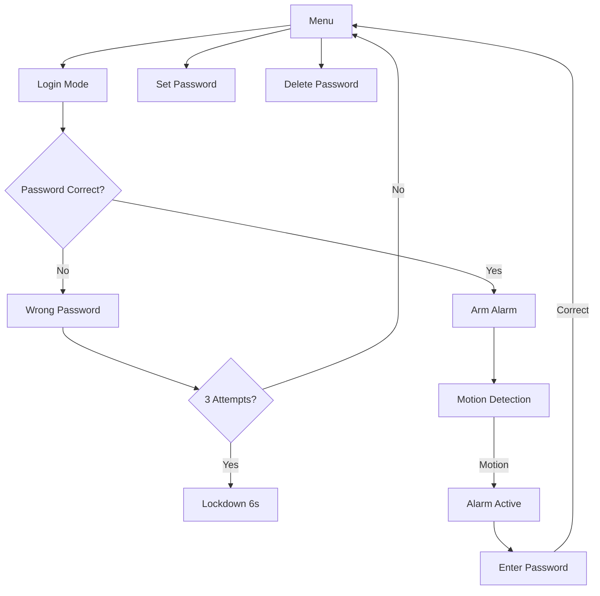

# SecurePico Web - IoT Security System with Remote Dashboard

A comprehensive home security system built with MicroPython for Raspberry Pi Pico, featuring password authentication, motion detection, and alarm functionality with OLED display and keypad interface.

## 🚀 Features

- **Password Authentication**: Secure SHA-256 hashed password system
- **Motion Detection**: PIR sensor integration for intrusion detection
- **Multi-Mode Interface**: Login, password setting, and menu navigation
- **Security Lockdown**: Automatic lockout after failed attempts
- **Visual Feedback**: 128x64 OLED display with real-time status
- **Audio Alerts**: Buzzer notifications for different events
- **LED Indicators**: Red/green LEDs for system status
- **Persistent Storage**: Password saved to flash memory
- **Timeout Protection**: Auto-logout after inactivity

## 🛠️ Hardware Requirements

| Component | Quantity | Purpose |
|-----------|----------|---------|
| Raspberry Pi Pico 2 | 1 | Main microcontroller |
| SSD1306 OLED Display (128x64) | 1 | User interface |
| 4x4 Matrix Keypad | 1 | Password input |
| PIR Motion Sensor | 1 | Motion detection |
| Buzzer | 1 | Audio alerts |
| LEDs (Red, Green) | 2 | Visual indicators |
| Resistors (330Ω) | 2 | LED current limiting |
| Breadboard/PCB | 1 | Circuit assembly |
| Jumper Wires | - | Connections |

## 📋 Pin Configuration

```
Raspberry Pi Pico Pinout:
├── GPIO 0  → SDA (OLED)
├── GPIO 1  → SCL (OLED)
├── GPIO 2-5 → Keypad Rows
├── GPIO 6-9 → Keypad Columns
├── GPIO 16 → Red LED
├── GPIO 17 → Buzzer
├── GPIO 18 → Green LED
└── GPIO 19 → PIR Sensor
```

## 🔧 Circuit Diagram

```
    Raspberry Pi Pico
         ┌─────┐
    SDA──┤ 0   │
    SCL──┤ 1   │
    R1───┤ 2   │
    R2───┤ 3   │         OLED Display
    R3───┤ 4   │         ┌──────────┐
    R4───┤ 5   │    SDA──┤SDA    VCC├──3.3V
    C1───┤ 6   │    SCL──┤SCL    GND├──GND
    C2───┤ 7   │         └──────────┘
    C3───┤ 8   │
    C4───┤ 9   │         4x4 Keypad
         │     │         ┌──────────┐
    LED──┤ 16  │    R1───┤1      5├───C1
    BUZ──┤ 17  │    R2───┤2      6├───C2
    LED──┤ 18  │    R3───┤3      7├───C3
    PIR──┤ 19  │    R4───┤4      8├───C4
         └─────┘         └──────────┘
```

## 🚦 Installation

### 1. Flash MicroPython
```bash
# Download MicroPython firmware for Raspberry Pi Pico
# Flash using Thonny IDE or rshell
```

### 2. Install Required Libraries
```python
# Upload these files to your Pico:
# - ssd1306.py (OLED driver)
# - main.py (this project)
```

### 3. Upload Code
```bash
# Using Thonny IDE:
# 1. Open the security_system.py file
# 2. Save as main.py on the Pico
# 3. Reset the device
```

## 💻 Usage

### Initial Setup
1. **Power on** the system
2. **Press D** to set your first password
3. **Enter 4-8 digits** and press **#** to confirm
4. System will show "Password set!" confirmation

### Daily Operation
- **Press A**: Login and arm the alarm
- **Press D**: Change existing password
- **Hold \***: Delete saved password (3-second hold)

### Keypad Controls
| Key | Function |
|-----|----------|
| **0-9** | Enter password digits |
| **A** | Login/Arm system |
| **D** | Set/Change password |
| **#** | Confirm password |
| **C** | Backspace |
| **\*** | Delete password (hold) |

### Security Features
- **3 failed attempts** → 6-second lockout
- **10-second timeout** → Auto-return to menu
- **Motion detection** → Automatic alarm trigger
- **Password required** to disarm alarm

## 🔒 Security Implementation

- **SHA-256 Hashing**: Passwords never stored in plain text
- **Flash Storage**: Persistent password storage across reboots
- **Attempt Limiting**: Prevents brute force attacks
- **Session Timeout**: Automatic logout for security
- **Motion Triggered**: Immediate alarm on unauthorized movement

## 📱 System States



## 🔔 Alert System

| Event | LED | Buzzer | Display |
|-------|-----|--------|---------|
| Correct Password | Green | High tone | "Welcome!" |
| Wrong Password | Red | Low tone | "Wrong Password!" |
| Motion Detected | - | Continuous | Alarm screen |
| Password Set | Green | Success tone | "Password set!" |
| System Locked | Red | Warning tone | Lockdown timer |

## 🐛 Troubleshooting

### Common Issues
- **OLED not displaying**: Check I2C connections (SDA/SCL)
- **Keypad not responding**: Verify row/column pin connections
- **PIR false triggers**: Adjust sensor sensitivity or add delay
- **Password not saving**: Ensure flash write permissions

### Debug Mode
```python
# Add debug prints in main.py:
print(f"Password entered: {len(entered_password)} chars")
print(f"Current mode: {current_mode}")
```

## 🔮 Future Enhancements

- [ ] **WiFi Integration**: Remote monitoring and alerts
- [ ] **Mobile App**: Smartphone control interface
- [ ] **Multiple Users**: Different access levels
- [ ] **Time-based Access**: Scheduled arming/disarming
- [ ] **Camera Integration**: Photo capture on motion
- [ ] **Database Logging**: Event history and analytics
- [ ] **Web Dashboard**: Browser-based control panel

## 📊 Technical Specifications

- **Microcontroller**: RP2040 (Dual-core ARM Cortex-M0+)
- **Clock Speed**: 133 MHz
- **Memory**: 264KB SRAM, 2MB Flash
- **Language**: MicroPython 3.4+
- **Display**: SSD1306 OLED (128x64, I2C)
- **Input**: 4x4 Matrix Keypad
- **Storage**: Flash-based password persistence

## 🤝 Contributing

1. **Fork** the repository
2. **Create** a feature branch (`git checkout -b feature/AmazingFeature`)
3. **Commit** your changes (`git commit -m 'Add AmazingFeature'`)
4. **Push** to the branch (`git push origin feature/AmazingFeature`)
5. **Open** a Pull Request

## 📄 License

This project is licensed under the MIT License - see the [LICENSE](LICENSE) file for details.

## 👨‍💻 Author

**Your Name**
- GitHub: [@yourusername](https://github.com/yourusername)
- LinkedIn: [Your LinkedIn](https://linkedin.com/in/yourprofile)
- Email: your.email@example.com

## 🙏 Acknowledgments

- MicroPython community for excellent documentation
- Raspberry Pi Foundation for the Pico platform
- Open source contributors for SSD1306 drivers

---

⭐ **Star this repo** if you found it helpful!
