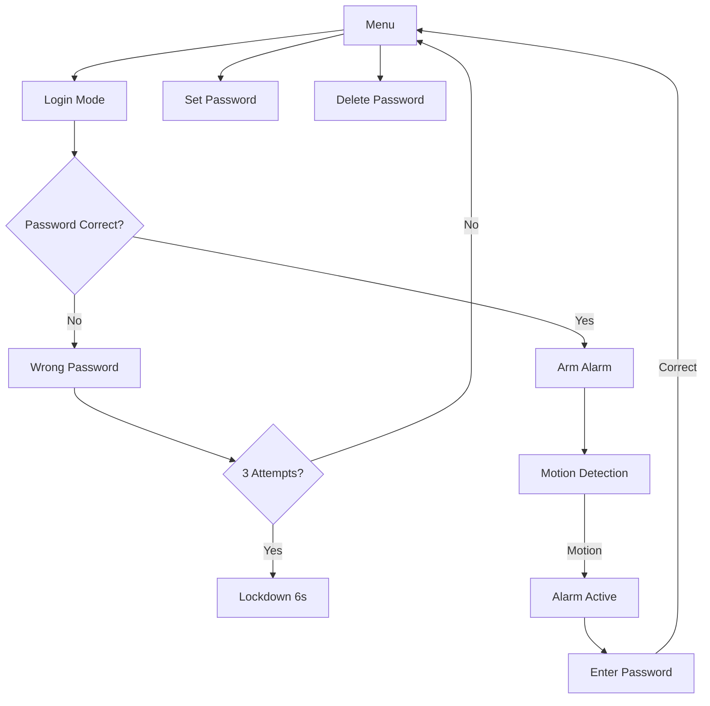

# SecurePico - IoT Security System with Motion Detection

A comprehensive home security system built with MicroPython for Raspberry Pi Pico, featuring password authentication, PIR motion detection, and alarm functionality with OLED display and 4x4 keypad interface.

## Features

- **Password Authentication**: Secure SHA-256 hashed password system with persistent flash storage
- **Motion Detection**: PIR sensor integration with debounce protection
- **Alarm System**: Armed/disarmed states with motion-triggered alerts
- **Security Lockdown**: 6-second lockout after 3 consecutive failed attempts
- **Visual Interface**: 128x64 OLED display with real-time status and menus
- **Audio Feedback**: PWM buzzer with different tones for various events
- **LED Indicators**: Red/green LEDs for visual status confirmation
- **Password Management**: Set, change, and delete passwords with confirmation
- **Input Validation**: Maximum 8-digit password length with masked display

## Hardware Requirements

| Component | Quantity | Purpose |
|-----------|----------|---------|
| Raspberry Pi Pico | 1 | Main microcontroller |
| SSD1306 OLED Display (128x64, I2C) | 1 | User interface |
| 4x4 Matrix Keypad | 1 | Password input and navigation |
| PIR Motion Sensor (HC-SR501) | 1 | Motion detection |
| Active Buzzer | 1 | Audio alerts |
| LEDs (Red, Green) | 2 | Visual status indicators |
| Resistors (220Ω-330Ω) | 2 | LED current limiting |
| Breadboard or PCB | 1 | Circuit assembly |
| Jumper Wires | Various | Connections |

## Circuit Connections

### OLED Display (I2C)
```
OLED Pin → Pico Pin
VCC      → 3.3V
GND      → GND
SDA      → GPIO 0
SCL      → GPIO 1
```

### 4x4 Matrix Keypad Layout
```
Keypad Layout:      Pin Connections:
┌───────────────┐   Row 1 → GPIO 2
│ 1 │ 2 │ 3 │ A │   Row 2 → GPIO 3
├───┼───┼───┼───┤   Row 3 → GPIO 4
│ 4 │ 5 │ 6 │ B │   Row 4 → GPIO 5
├───┼───┼───┼───┤   Col 1 → GPIO 6
│ 7 │ 8 │ 9 │ C │   Col 2 → GPIO 7
├───┼───┼───┼───┤   Col 3 → GPIO 8
│ * │ 0 │ # │ D │   Col 4 → GPIO 9
└───────────────┘
```

### Other Components
```
Component     → Pico Pin
Red LED (+)   → GPIO 16 → 330Ω → LED → GND
Green LED (+) → GPIO 18 → 330Ω → LED → GND
Buzzer (+)    → GPIO 17
Buzzer (-)    → GND
PIR VCC       → 5V (VBUS)
PIR GND       → GND
PIR OUT       → GPIO 19
```

## Installation

### 1. Prepare Raspberry Pi Pico
1. Download latest MicroPython firmware for Raspberry Pi Pico
2. Hold BOOTSEL button while connecting USB cable
3. Copy `.uf2` firmware file to RPI-RP2 drive
4. Pico will restart automatically

### 2. Install Required Libraries
```python
# Download ssd1306.py OLED driver library
# Copy to Pico using Thonny IDE or rshell
```

### 3. Upload Main Code
1. Open Thonny IDE
2. Copy the security system code
3. Save as `main.py` on the Raspberry Pi Pico
4. Reset the device or press Ctrl+D in REPL

## Operation Guide

### First Time Setup
1. **Power on** - System displays main menu
2. **Press D** - Enter password setup mode
3. **Enter digits** (1-8 characters) using number keys
4. **Press #** - Confirm and save password
5. **Success** - Green LED + confirmation tone

### Daily Operations

#### Login and Arm System
1. **Press A** from main menu
2. **Enter password** using keypad
3. **Press #** to confirm
4. **System armed** - Motion detection active

#### Change Password
1. **Press D** from main menu
2. **Enter current password** and press #
3. **Enter new password** and press #
4. **Confirmation** - Password updated

#### Motion Detection
- When armed, PIR sensor monitors for movement
- **Motion detected** → Alarm activates immediately
- **Enter password** to disarm and stop alarm

### Keypad Reference

| Key | Function |
|-----|----------|
| **0-9** | Enter password digits |
| **A** | Login/Access system |
| **D** | Set/Change password |
| **#** | Confirm password entry |
| **C** | Backspace (delete last digit) |
| **\*** | Delete saved password |

## Security Features

### Password Protection
- **SHA-256 hashing** ensures passwords never stored in plaintext
- **Flash persistence** maintains passwords across power cycles
- **Maximum 8 digits** prevents excessively long inputs
- **Masked display** shows asterisks instead of actual digits

### Anti-Tampering
- **Failed attempt tracking** counts incorrect password entries
- **Automatic lockout** after 3 consecutive failures
- **6-second timeout** prevents rapid brute force attempts
- **Visual feedback** shows remaining lockout time

### Motion Detection
- **PIR sensor integration** with 2-second debounce protection
- **Immediate alarm** activation upon motion detection
- **Continuous buzzer** until correct password entered
- **Armed/disarmed states** for controlled monitoring

## System State Flow

## Alert System

| Event | Red LED | Green LED | Buzzer | Display Message |
|-------|---------|-----------|--------|-----------------|
| Correct Password | - | ✓ | High tone (3000Hz) | "Welcome!" |
| Wrong Password | ✓ | - | Low tone (2000Hz) | "Wrong Password!" |
| Password Saved | - | ✓ | Success tone | "Password saved" |
| Motion Detected | - | - | Continuous alarm | Alarm display |
| System Locked | ✓ | - | Warning tone | Lockout timer |
| Key Press | ✓ (brief) | - | Short beep | Input feedback |

## Troubleshooting

### Display Issues
- **Blank OLED**: Check I2C wiring (SDA/SCL), verify 3.3V power
- **Garbled display**: Ensure correct I2C address (0x3C for most SSD1306)
- **Intermittent display**: Check loose connections

### Keypad Problems
- **No key response**: Verify all 8 pin connections to keypad
- **Wrong characters**: Check row/column pin mapping
- **Multiple key presses**: Clean keypad contacts, check debouncing

### Sensor Issues
- **PIR false triggers**: Adjust sensitivity potentiometer, check power supply
- **No motion detection**: Verify 5V power to PIR, check signal wire
- **Continuous triggering**: Allow PIR warm-up time (30-60 seconds)

### Password Issues
- **Can't save password**: Check flash memory space, verify file permissions
- **Password not persistent**: Ensure proper file system mounting
- **Hash errors**: Verify SHA-256 library availability

## Technical Specifications

### Microcontroller
- **Processor**: RP2040 dual-core ARM Cortex-M0+ @ 133MHz
- **Memory**: 264KB SRAM, 2MB Flash storage
- **GPIO**: 26 programmable pins, PWM, I2C, SPI support
- **Power**: 1.8-5.5V operating voltage

### Software
- **Language**: MicroPython 3.4+
- **Libraries**: hashlib, ubinascii, machine, ssd1306
- **Storage**: Flash-based file system for persistence
- **Real-time**: Hardware timer-based scheduling

### Performance
- **Response Time**: <100ms keypad input processing
- **PIR Sensitivity**: Adjustable detection range up to 7 meters
- **Password Security**: SHA-256 cryptographic hashing
- **System Reliability**: Watchdog timer protection

